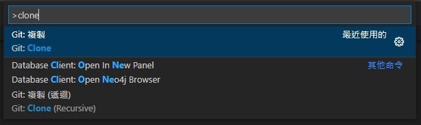
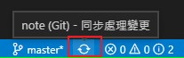

## 【基本】
[Git教學](https://www.runoob.com/git/git-basic-operations.html)

### 建立存放庫初始化
```properties
git init
git init 路徑檔案
```

### 暫存變更_add
```properties
git add .         //暫存全部
git add 路徑檔案
```

### 取消暫存變更_reset
```properties
git reset .       //取消暫存全部
git reset 路徑檔案
```

### 提交_commit
```properties
git commit -m "填寫版本資訊"
git commit
```

__________________________________________________
## 【遠端連接】
[參考這裡](https://www.runoob.com/git/git-remote.html)

__________________________________________________
## 【遠端同步】

### 複製_clone


### 推_push

```properties
git push 遠端主機名 本地分支名:遠端分支名
git push origin master
```

### 拉_pull

```properties
git pull 遠端主機名 遠端分支名:本地分支名
git pull origin master:dev
git pull origin master
```

__________________________________________________
## 【分支】

### 建立分支_branch
```properties
git branch 分支名     //建立分支
git branch -d 分支名  //刪除分支
```

### 切換分支_checkout
```properties
git checkout 分支名
```

### 合併分支_merge
[其他合併方式參考](https://stackoverflow.com/questions/9069061/what-effect-does-the-no-ff-flag-have-for-git-merge)


```properties
git merge 分支B    //目前分支A 合併 分支B (將B的更新 給A)
```

__________________________________________________
## 【特殊處理】

### 回復版本

```properties
git reset --hard HEAD    //回復到最新提交版本
git reset --hard HEAD~   //等於 ~1 回復到上一個提交版本
git reset --hard HEAD~n  //n 等於往上第幾個提交版本 回復之前指定的提交版本
```

### 合併(merge)時忽略指定檔案
[參考](https://stackoverflow.com/questions/14369378/how-to-make-git-ignore-a-directory-while-merging)
```properties
git checkout master    
git merge --no-commit --no-ff development
git reset -- /path/to/folder # revert updates from path
git commit

簡易說明:
1. 先 main 合併(merge) dev
2. 捨棄(reset) 不要合併的檔案
3. commit
```